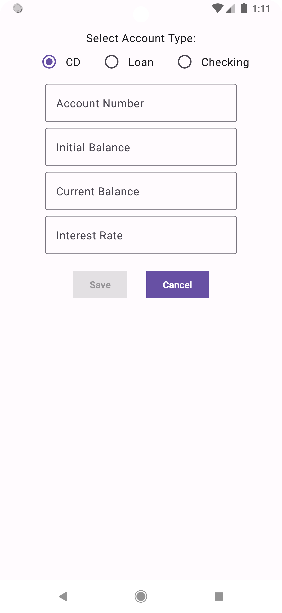
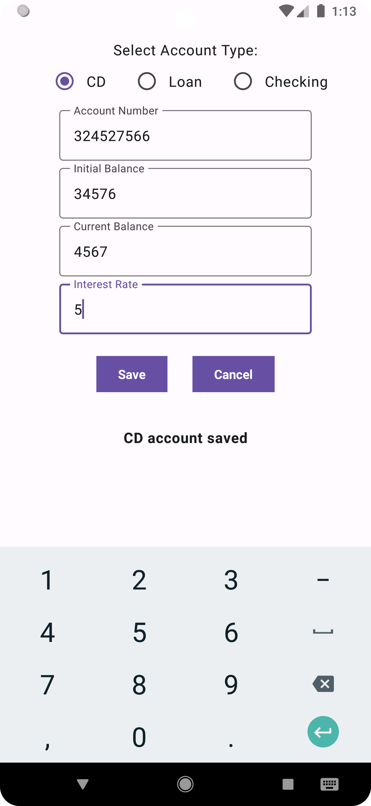

# MyFinances

**MyFinances** is a **simple finance management Android app** built with **Jetpack Compose** and **Room Database**.  
It allows users to manage multiple account types (**CD, Loan, Checking**), save account data, and view balances and interest information.  

---

## Table of Contents

- [Features](#features)
- [Screenshots](#screenshots)
- [Installation](#installation)
- [Usage](#usage)
- [Dependencies](#dependencies)
- [Database](#database)

---

## Features

- Select account type: **CD, Loan, or Checking**  
- Enter account details including balances, interest rates, and payment amounts  
- Save accounts locally using **Room Database**  
- Validates input before saving  
- Displays success/error messages  
- Built with **Jetpack Compose** for modern declarative UI  

---

## Screenshots

<p float="left">
  
  
</p>

*Main screen showing account type selection, input fields, and Save/Cancel buttons.*

---

## Installation

1. Clone the repository:
```bash
git clone https://github.com/yourusername/TipCalculator.git
```
2. Open the project in **Android Studio**.  
3. Ensure your Android SDK is set to **API 34** or higher.  
4. Build and run the app on an emulator or device running **Android 7.0 (API 24)** or higher.

---

## Usage

1. Launch the app.  
2. Select the **account type** (CD, Loan, or Checking).  
3. Fill in the relevant account fields:  
   - **CD:** Account Number, Initial Balance, Current Balance, Interest Rate  
   - **Loan:** Account Number, Initial Balance, Current Balance, Interest Rate, Payment Amount  
   - **Checking:** Account Number, Current Balance  
4. Press **Save** to store the account in the local database.  
5. Press **Cancel** to reset the form.  
6. Saved accounts are printed to the log (for in-memory database preview).

---

## Dependencies

Key dependencies:

- **Jetpack Compose** (Material 3, UI, UI Tooling)  
- **Compose activity integration** (`activity-compose`)  
- **Room Database** (Room Runtime, Room KTX, Room Compiler)  
- **Kotlin Coroutines** for asynchronous operations  
- **AndroidX Core KTX, AppCompat, ConstraintLayout**  
- **JUnit & Espresso** for testing  

Full versions are defined in `build.gradle`.

---

## Database

The app uses **Room** for local storage:

- **Entities:** `CDAccount`, `LoanAccount`, `CheckingAccount`  
- **DAOs:** Each entity has a DAO with methods to insert and fetch all accounts  
- **Database class:** `AppDatabase`  

Example usage:

```kotlin
val db = Room.inMemoryDatabaseBuilder(
    applicationContext,
    AppDatabase::class.java
).build()
```
